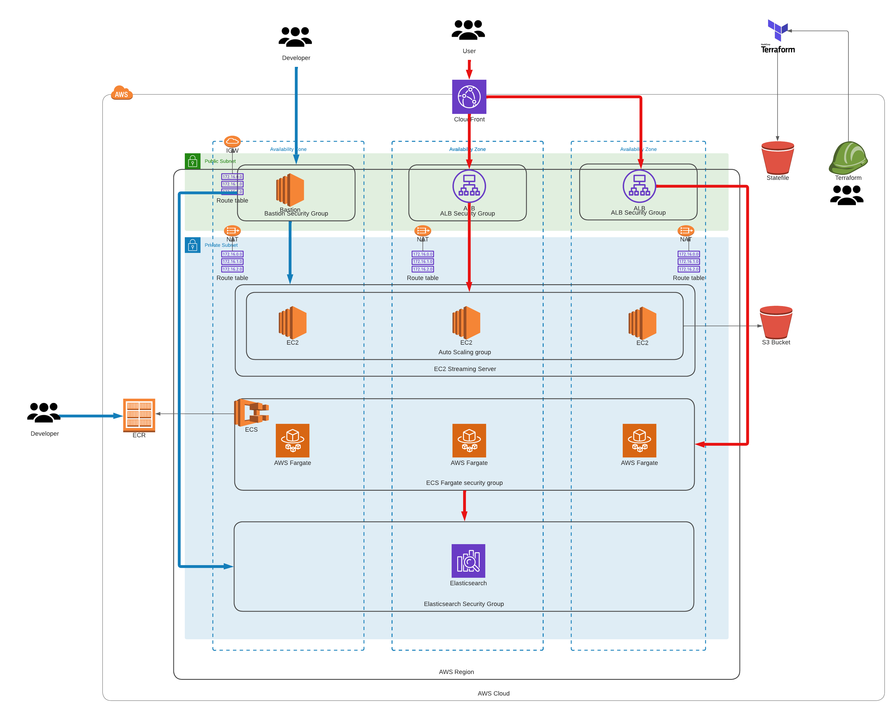
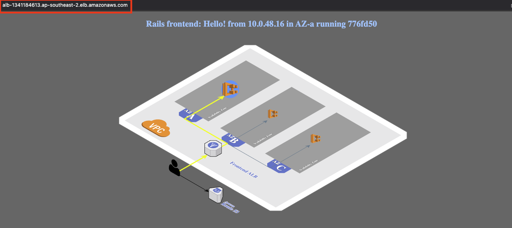
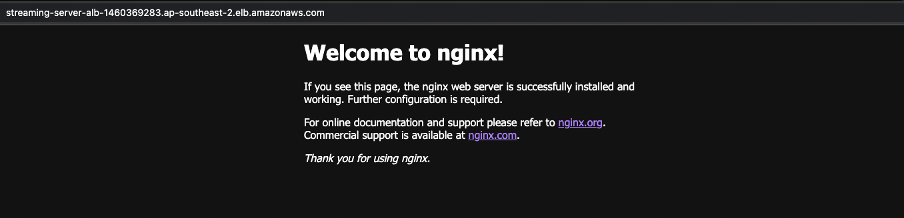

## Summary

This repo will create your custom EC2, ECS, and OpenSearch environment.

## Basic Architecture



# Pre-requisite

- AWS_ACCESS_KEYS and AWS_SECRET_ACCESS_KEYS are set as environment variables (link: https://docs.aws.amazon.com/cli/latest/userguide/cli-configure-envvars.html)
- Terraform version > 1.1.5 (version 1.3.7 suggested) installed on your local machine
- Review ECS Fargate Development. (Link: https://docs.aws.amazon.com/AmazonECS/latest/userguide/what-is-fargate.html)
- Review Amazon OpenSearch Service Guide Development. (Link: https://docs.aws.amazon.com/opensearch-service/latest/developerguide/gsg.html)

### Step by Step deployment for your custom environment
* **Step 1: Clone the Repo**. This command will clone the repo and will change directory the recently cloned repo
```shell script
$ git clone https://github.com/antonio-rufo/tf-beeb234.git
```

* **Step 2: Create a S3 bucket for remote state storage.** Update the `terraform.tfvars` file with your `aws_account_id` and Optionally `region` and `environment`

```shell script
$ cd tf-beeb234
$ cd statebucket
$ vi terraform.tfvars
```
Create the resources:
```shell script
$ terraform init
$ terraform plan
$ terraform apply --auto-approve
```
Take note of the output for `state_bucket_id`. You'll need to update the `main.tf` on each layer with it. It is not yet possible to have the state bucket values interpolated.  

* **Step 3: Create your base and network layer.** Update the `terraform.tfvars` file with your `aws_account_id` and Optionally `region` and `environment`. Then update `main.tf` with the **state_bucket_id** created in step 2 (line 18).

In terraform.tfvars, set variable `single_nat_gateway` to `false` for Production environment; to have 3 NAT gateways for high availability (HA).

In this layer, I've also added in a sample entry for ECR in case if you want to use ECR for storing your container images.

```shell script
$ cd ../infrastructure/000base
$ vi terraform.tfvars
$ vi main.tf
```
Create the resources:
```shell script
$ terraform init
$ terraform plan
$ terraform apply --auto-approve
```

* **Step 4: Create your Key Pair for both the Bastion and Streaming Server instances.** We'll need Key Pairs to login to both the Jumphost and the Streaming Server instances respectively.

Login to AWS Console > AWS > Key Pair > click `Create key pair`
Select `RSA` as Key Pair Type.
Select `.pem` if you are using Mac
Select `.ppk` if you are using Windows
click `Create key pair` and save it on a safe spot. You will be using the newly created Key Pair for a long time.

* **Step 5: Create your Compute layer.** Update the `terraform.tfvars` file with your `aws_account_id`, `bastion_ec2_instance_type`, `streaming_server_ec2_key_name` and Optionally `region` and `environment`. Then update `main.tf` with the **state_bucket_id** created in step 2 (lines 18 and 32).

In the tfvars, you can customise your ECS service configuration. Ex. Container image to use, container name, container port, etc.

```shell script
$ cd ../100compute
$ vi terraform.tfvars
$ vi main.tf
```
Create the resources:
```shell script
$ terraform init
$ terraform plan
$ terraform apply --auto-approve
```

* **Step 7: Check if the ECS Sample application is working.**
In the output section of the 100compute layer, there will be an output called `ecs_alb_dns`.

Wait for around 3-5 minutes. Paste value in your Browser.

You should be able to see:



* **Step 8: Check if the Streaming Server sample application is working.**
In the output section of the 100compute layer, there will be an output called `streaming_server_alb_dns`.

Wait for around 3-5 minutes. Paste value in your Browser.

You should be able to see:


